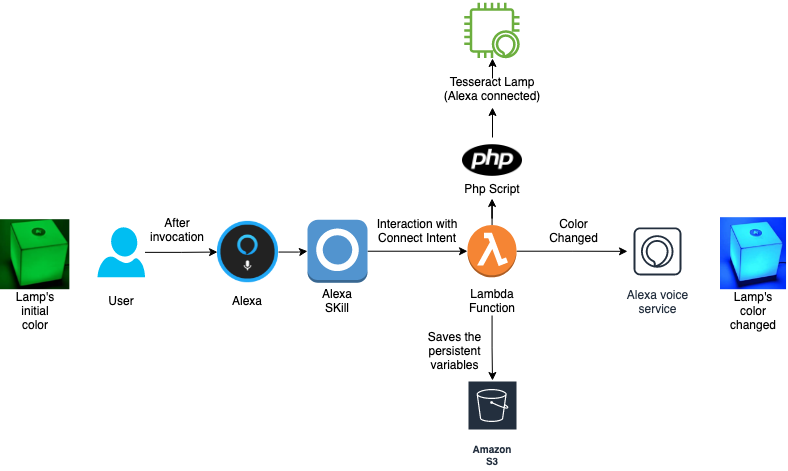
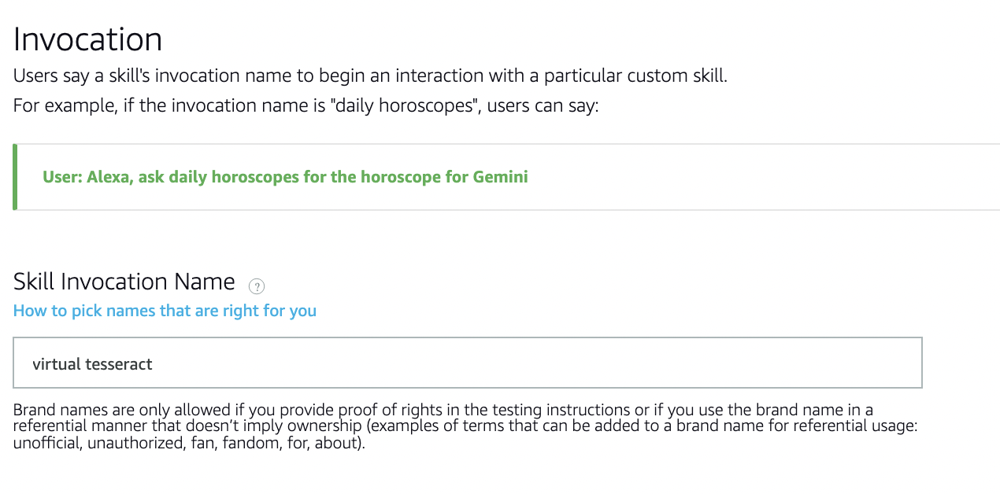
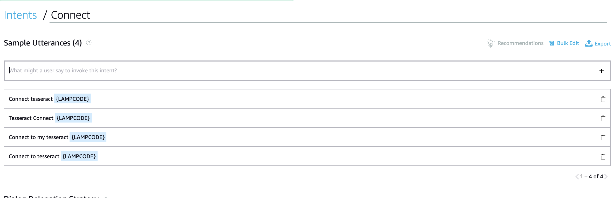
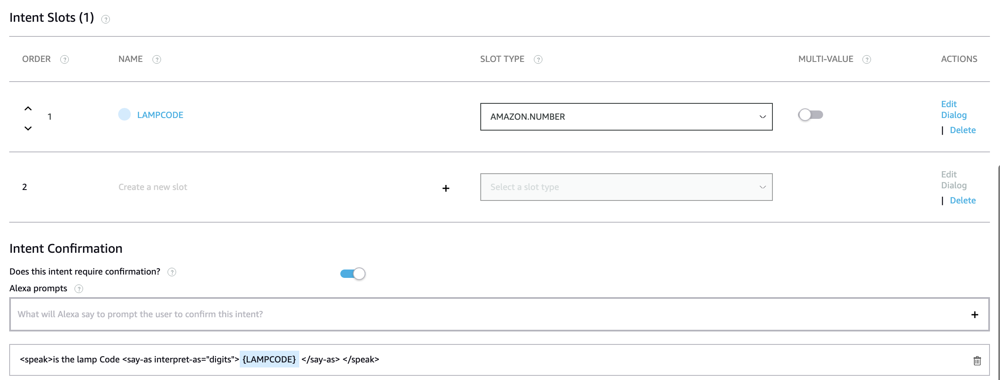
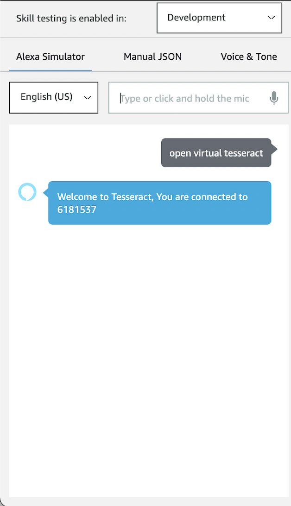
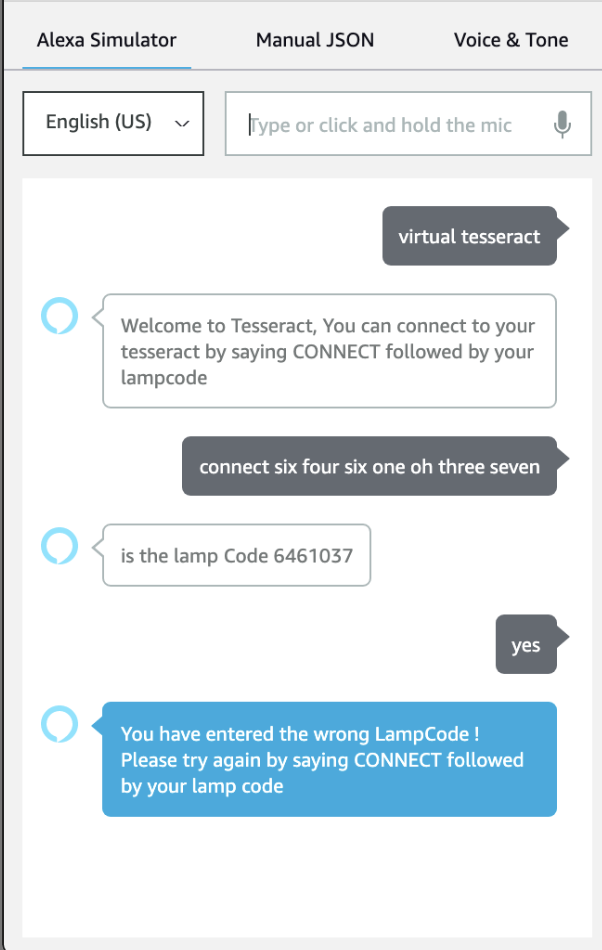
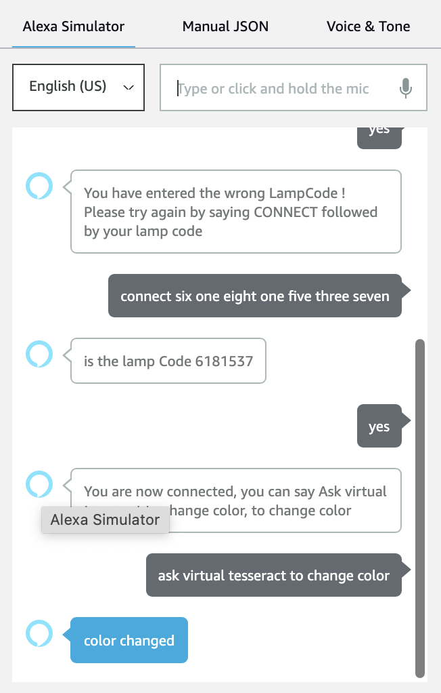

# Alexa skill with IoT Integration using custom PHP API 
#### Built for my company Tesseract Lights (https://tesseract.rezzlon.com)

This API based Alexa Skill was used to authenticate and turn on IOT Lamps through the Internet. The Alexa skill based on AWS Lambda, makes two API calls. Alexa takes the input for the Lamp Code (Unique code given by us to the lamps) and build the API query and makes a POST request. The API returns a value which authenticates the Lamp. Once its authenticated, we store the lamp code in the Alexa Persistance S3 bucket with the Alexa UID.
The next API endpoint is called everytime the user initiates a color change using alexa. The lampcode stored in the S3 bucket is fetched and sent along with the HTTP post request.


## Design Architecture




## API Reference

#### Authenticate the Lampcode

```http
  POST endpoint/?lampcode=?,UID=?
```

| Parameter | Type     | Description                |
| :-------- | :------- | :------------------------- |
| `Lampcode` | `string` | **Required**. Your Lampcode|
| `UID` | `string` | **Required**. Alexa UID (automatic)|

#### Change the color

```http
  POST endpoint/?lampcode=?,color=?
```
If color is not mentioned in the API request, the next color in the list is automatically selected.
| Parameter | Type     | Description                |
| :-------- | :------- | :------------------------- |
| `Lampcode` | `string` | **Required**. Your Lampcode|
| `Color` | `string` | The color needed to be changed|

  
## Configurations of Alexa Developer Console

- Create an Invocation Name, that will trigger the Alexa skill. In our case it is " Virtual Tesseract"



- Create a Intent and link it with a Intent launching phrases. These phrases triggers the function and performs it. 




- A Intent SLot is a variable that is collected from the User by Alexa, which is stored as a persistant variable later using Attributes manager from the lambda code. Now create a Lamp Slot which gets the lampcode from the user which is later used for the API call. We can also use the inbuilt Intent SLot confirmation function to automatically verify the value with the user. 



- With the basic configuration done, now we tap into the intent from the lambda code using the intent handler code block which handles the intent request call from the Alexa. 
- We send an API Call to connect and change the color. The script hosted in the server is connected with the Lamp.

# Demo





